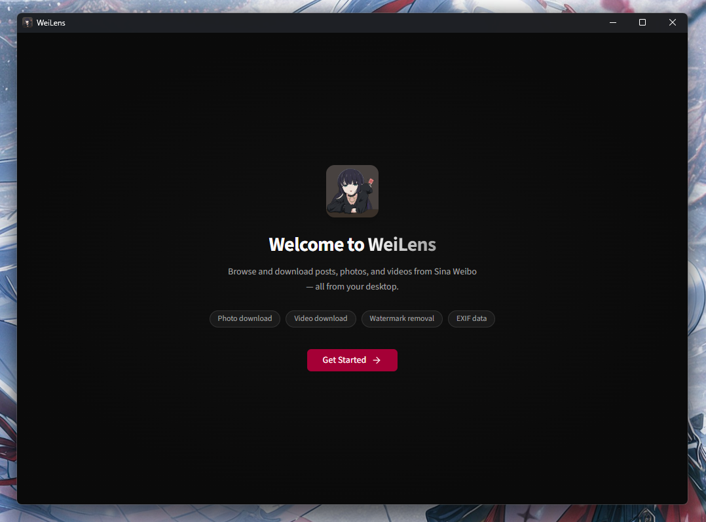
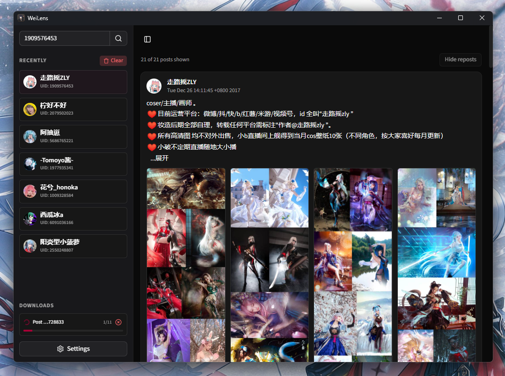
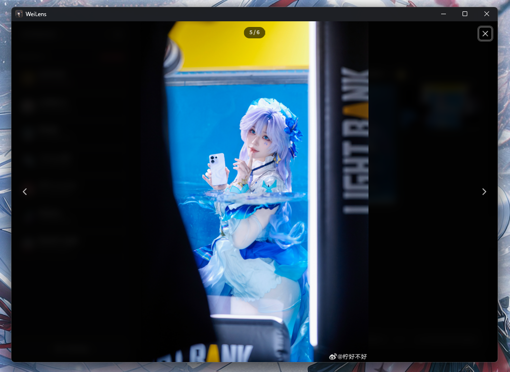
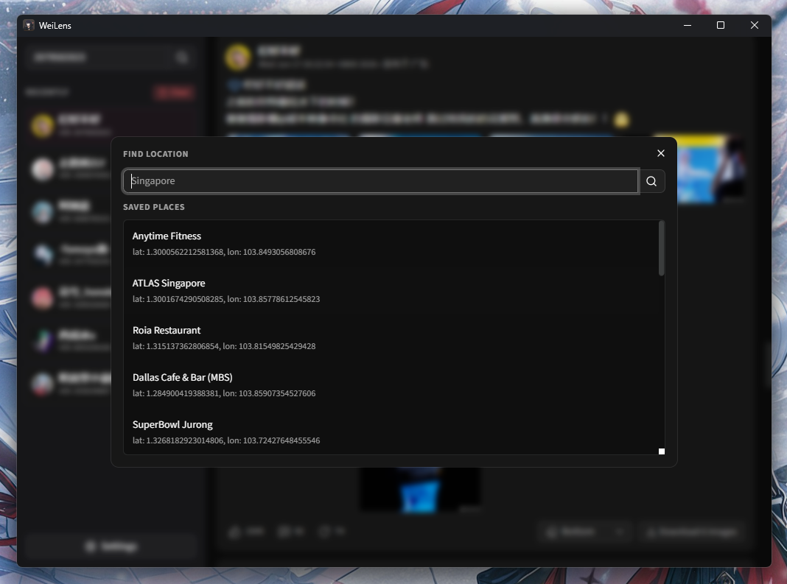

<p align="center">
  
</p>

<h1 align="center">WeiLens</h1>

<p align="center">
  A desktop viewer and downloader for Sina Weibo, built with Tauri v2 and React 19.
</p>

<p align="center">
  
  
  
  
</p>

---

WeiLens lets you browse a Weibo user's blog feed, view and download posts with watermark removal, EXIF metadata, GPS tagging, and motion photo support — all from a native desktop app.

## Preview

<table>
  <tr>
    <td align="center"><b>Onboarding</b></td>
    <td align="center"><b>Feed</b></td>
  </tr>
  <tr>
    <td></td>
    <td></td>
  </tr>
  <tr>
    <td align="center"><b>Image Viewer</b></td>
    <td align="center"><b>Location Tagging</b></td>
  </tr>
  <tr>
    <td></td>
    <td></td>
  </tr>
</table>

## Features

### Feed & Browsing

- Look up any Weibo user by UID and browse their blog feed
- Infinite scroll with lazy-loaded feed
- Smooth page transitions and animated feed updates

### Image Viewer

- Responsive masonry grid layout
- Medium-width image loading for faster display
- Fullscreen viewer with navigation controls

### Downloads

- Batch download posts (images, live photos)
- Exponential backoff retries on failure
- Per-post download cancellation
- Custom download directory selection
- Date-based folder organization
- Real-time progress tracking

### Watermark Removal

- Automatic watermark strip merging using pixel-accurate compositing
- Configurable watermark position (top, center, bottom)
- Original-quality output — only the watermark strip is replaced
- Position is set via a button beside the download button on each post, or as a default in Settings
- Note: may not work if the original post was uploaded with a baked-in watermark

### EXIF & Metadata

- Automatic EXIF metadata writing with randomized iPhone model data
- GPS coordinate embedding (from saved places)

### Motion Photo Support

- Live photo muxing — combines still image + video into a single motion photo
- Google Motion Photo format (SEF tag)
- Supports both MP4 and QuickTime containers

### Places & Location

- Save and manage GPS coordinates for tagging downloads
- Search, add, and remove custom places
- Per-post place assignment
- Location dialog with place management UI

### Settings & Onboarding

- Guided onboarding flow for first-time setup
- Cookie configuration with support for plain `name=value` and Netscape/jar format

### UI & UX

- Smooth `motion` (framer-motion v12) animations throughout
- AnimatePresence for state transitions
- shadcn/ui components (base-nova style, neutral base color)
- Responsive sidebar with mobile hamburger toggle
- Lucide icons throughout

## Tech Stack

| Layer                | Technology                                              |
| -------------------- | ------------------------------------------------------- |
| **Desktop shell**    | [Tauri v2](https://v2.tauri.app/) (Rust)                |
| **Frontend**         | React 19, TypeScript 6, Vite 8                          |
| **Styling**          | Tailwind CSS v4, shadcn/ui (base-nova)                  |
| **State**            | Zustand 5, React Query 5                                |
| **Animation**        | motion v12 (framer-motion)                              |
| **Forms**            | Zod 4 validation                                        |
| **Database**         | SQLite via rusqlite (bundled)                           |
| **HTTP**             | reqwest (Rust), `@tauri-apps/plugin-http` (frontend)    |
| **Image processing** | `image` crate, `little_exif`, `img-parts`, `xmp-writer` |
| **Package manager**  | Bun                                                     |

## Download

Pre-built installers for Windows are available on the [GitHub Releases](https://github.com/nullxception/weilens/releases) page.

## Getting Started

### Prerequisites

- [Rust](https://rustup.rs/) (latest stable)
- [Bun](https://bun.sh/) (for frontend dependencies)
- [Tauri v2 prerequisites](https://v2.tauri.app/start/prerequisites/) (system dependencies per platform)

### Install & Run

```bash
# Clone the repository
git clone https://github.com/nullxception/weilens.git
cd weilens

# Install frontend dependencies
bun install

# Run the full app (Rust + frontend with hot-reload)
bun run tauri dev
```

## Building

```bash
# Build for production
bun run tauri build
```

The output installer/binary will be in `src-tauri/target/release/bundle/`.

### Verification

Run the full verification pipeline before submitting changes:

```bash
# Frontend
bun run lint
bun run typecheck
bun run build

# Rust backend (from src-tauri/)
cd src-tauri
cargo clippy
cargo build
```

## Architecture

### Image Proxy

WeiLens uses a custom `img-proxy:` URI scheme registered by the Rust backend to fetch and serve images from Sina's CDN without CORS issues. The frontend builds platform-aware proxy URLs:

- **Windows:** `http://img-proxy.localhost/?url=...` (WebView2 subdomain requirement)
- **macOS/Linux:** `img-proxy://localhost/?url=...` (native protocol interception)

### API Access

Sina Weibo API calls (`weibo.com/ajax/statuses/mymblog`) are made through `@tauri-apps/plugin-http` to bypass CORS. A valid cookie string must be configured in settings. Both plain `name=value` and Netscape cookie-jar formats are supported.

### Data Flow

```
┌──────────────┐    Zod validation     ┌─────────────────┐
│  Sina API    │ ──────────────────▶   │  React Query    │
│  (HTTP)      │                       │  (cache + hooks)│
└──────────────┘                       └────────┬────────┘
                                                │
                                       ┌────────▼────────┐
                                       │  Zustand Stores  │
                                       │  (UI state)      │
                                       └────────┬────────┘
                                                │
                                       ┌────────▼────────┐
                                       │  Tauri IPC       │
                                       │  (invoke)        │
                                       └────────┬────────┘
                                                │
                                       ┌────────▼────────┐
                                       │  Rust Backend    │
                                       │  (download,      │
                                       │   image, db)     │
                                       └─────────────────┘
```

## Configuration

### Cookie

Your Weibo cookie is stored in the app's localStorage (under `wei_cookie`). Set it via the Settings panel or the onboarding flow. Required for all API access.

### Download Directory

Defaults to the system's `Downloads` folder. Changeable via Settings.

### Watermark Position

Sets the default watermark removal position (top, center, or bottom) for all downloads. Can be overridden per-post via the button beside the download button in the post footer.

## Contributing

1. Fork the repository
2. Create a feature branch (`git checkout -b feat/my-feature`)
3. Commit with conventional commits (`git commit -m 'feat: add my feature'`)
4. Push to the branch (`git push origin feat/my-feature`)
5. Open a Pull Request

Please run the verification pipeline (`lint` → `typecheck` → `build` for frontend, `cargo clippy` → `cargo build` for backend) before submitting.

## License

It's [MIT](./LICENSE).
